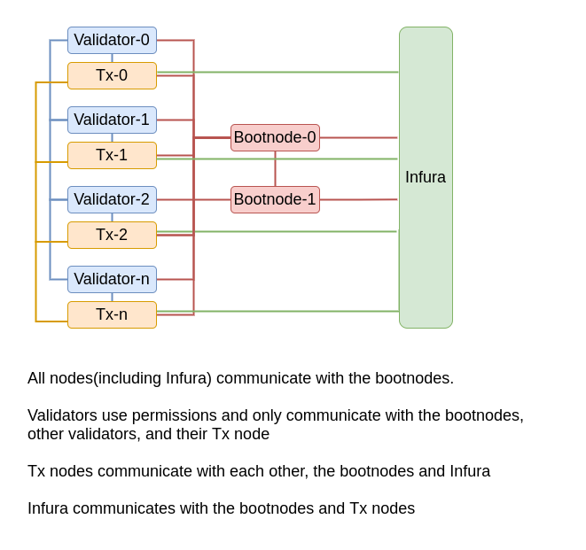

# Palm-node

This repo has been provided by ConsenSys Software Inc and has terrafrom scripts to create either a Palm node/s that runs [Hyperledger Besu](https://consensys.net/quorum/developers/) on AWS. Documentation for the Palm network itself can be found at https://docs.palm.io/

In addition it also has ansible scripts that let you perfrom routine updates to the Palm node once it is up and running.

| ⚠️ **WARNING**: We use terraform to provision infrastructure (ie ec2 instances) and ansible to provision HLF Besu on the instances. When you deploy things via terraform, if you have any changes in the file and re run it with `terraform apply` it could destroy existing instances and bring new ones up. Please do not run `terraform apply -auto-approve`, instead use `terraform plan` to get a list of changes and then apply if required. To make updates to the instances once they are up, such as edits to the permissions_config.toml file or to update versions of Besu, please use ansible only. Refer to the section titled *Update versions of Besu on your palm node* |
| --- |

### Glossary of terms:
* Enode: A method to identify a node comprising a node's public key and ip of the form "enode://<public_key>@<ip>:30303" where 30303 is the default discovery port
* Boot node: An ethereum node that starts the network off. This is essentially a node that is identical to a TX node but the enode's are known across the network. Every other node first connects to these nodes to obtain a list of peers (other nodes) and then the respective node will attempt to connect to each of those peers.
* Validator node: An ethereum node participating in a POA network that is repsonsible for proposing blocks and need to be available always.
* TX node: An ethereum node that accepts transactions. This is also sometimes refered to as a 'Reader node', 'Writer node', 'Observer node'


### Architecture:

Members joining the Palm network will normally create a normal 'Transaction node'. Some members will create a 'Validator node' - please note that when you opt to create a Validator node, the scripts in this repo will also create an Transaction node for you. When the network goes live there will be an initial pool of 5 validators. Any further validators have to be added/removed in via [voting](https://besu.hyperledger.org/en/latest/Tutorials/Private-Network/Adding-removing-IBFT-validators/). Please refer to the section on 'Process to add or remove Validators' below for more details.




### Testing:
Members are encouraged to test things on the Palm Dev and UAT test networks, and can do so by connecting to the Infura addresses. Members can optionally spin up a Transaction node to connect to the test network but are not required to do so - if you wish to create one, please set the `env_type` var to `uat` or `dev` and follow the steps below to create a Transaction node.


### Pre requisites:
- [Terraform](https://www.terraform.io/) v 0.15 or greater
- [Ansible](https://www.ansible.com/)
- OS (Ubuntu) packages:
```bash
sudo apt-get install git libselinux-python python python-pip python-setuptools python-virtualenv python3-pip python3 python3-setuptools jq"
```

### Connect to the Palm network:

There are a few ways you can connect to the Palm network:
1. Use the [Infura endpoints](https://docs.palm.io/Get-Started/Connect/Mainnet/) to read transaction history or send transactions on the Palm network without performing validator duties.
2. You can create a **Transaction Node** only which will also allow you to read transaction history or send transactions on the Palm network without performing validator duties. The difference here is that you own the node and are paying for it either in cloud or on premise.

  1. Edit the [variables.tf](./variables.tf) and add:
    - The appropriate vpc and region settings. 
    - You also need to add any IP's that you wish to whitelist to make RPC calls from to the `rpc_whitelist_cidrs` var. Otherwise you can make RPC calls only within the VPC or after you've ssh'd into the instance.
    - `create_monitoring_node` by default will create a small instance which will collect metrics from one ore more palm nodes that you deploy. You only need one of these for 'n' palm nodes.

  3. Run `terrafrom apply` 

  4. If you enabled the monitoring_node, once provisioning is complete, go to http://<MONITOING_INSTANCE_IP>:3000 and login with `admin:password`, and change the password details. Where possible we reccommend using one of the auth mechanisms that grafana [supports](https://grafana.com/docs/grafana/latest/auth/). Open the `Besu dashboard` to see stats of your node

  5. To view logs of the Besu node, ssh into the palm node instance and navigate to `/var/log/besu/`

  6. Update the inventory file so that you can update versions of Besu in time. Navigate to playbooks/inventories/prd.yml and add your node IP's to the file, if you created a validator node, please uncomment the validator section.


3. You can also choose to run a [**Validator Node**](./README-validators.md). This has a few more steps but your validator earns a reward for each block it creates. As with the transaction node, you own the infrasctructure and are paying for it, either in cloud or on premise. The validator nodes are responsible for creating blocks on the chain and need to be available always.

### Credits
The code in this repository was developed by ConsenSys Software Inc.
  


